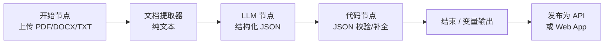

# Dify 简历信息提取器 — 学习笔记

基于 [Dify](https://dify.ai/) 搭建「简历 → 结构化 JSON」工作流的学习与实践记录。本仓库仅包含文档、提示词与示例 schema，**不包含真实简历或 API 密钥**。

## 学习目标

- 理解 Dify 中「开始 → 文档提取 → LLM 结构化输出 → 代码校验 → 发布 API」的典型链路
- 掌握用系统提示词约束 JSON 字段与类型，减少幻觉与漏字段
- 能在本地或自托管 Dify 中复现工作流，并通过 HTTP API 调用
- 建立隐私与密钥管理意识（不上传真实 PII、不提交 `.env`）

## 推荐工作流架构



| 节点 | 作用 | 注意点 |
|------|------|--------|
| 开始 | 接收简历文件或粘贴文本 | 限制格式与大小，避免扫描件无 OCR |
| 文档提取器 | 将二进制文档转为纯文本 | 复杂版式可能丢表格，需在提示词中说明 |
| LLM | 按 schema 输出 JSON | 温度宜低（0~0.3），开启 JSON 模式（若模型支持） |
| 代码 | `json.loads`、必填字段检查 | 失败时返回明确错误信息，便于重试 |
| 发布 | API Key、速率限制 | 密钥仅存环境变量，勿写入仓库 |

## 快速开始

1. **部署 Dify**  
   使用 [Dify 官方文档](https://docs.dify.ai/) 在云版或 Docker 自托管环境创建应用。

2. **导入工作流思路**  
   按 [`docs/dify-workflow.md`](docs/dify-workflow.md) 逐步添加节点并绑定变量。

3. **配置提示词**  
   将 [`docs/prompt-system.txt`](docs/prompt-system.txt) 内容粘贴到 LLM 节点的「系统提示词」。

4. **对齐输出结构**  
   参考 [`examples/schema-resume.json`](examples/schema-resume.json) 与 [`examples/output-sample.json`](examples/output-sample.json) 调整字段。

5. **测试与发布**  
   用虚构简历或脱敏样例在 Studio 中调试，确认 JSON 可解析后再「发布 → API」。

6. **调用 API（示例）**  
   将 `YOUR_API_KEY`、`YOUR_BASE_URL` 替换为控制台中的值（不要写入本仓库）：

```bash
curl -X POST "YOUR_BASE_URL/v1/workflows/run" \
  -H "Authorization: Bearer YOUR_API_KEY" \
  -H "Content-Type: application/json" \
  -d "{\"inputs\": {\"resume_file\": {\"transfer_method\": \"local_file\", \"upload_file_id\": \"FILE_ID\"}}, \"response_mode\": \"blocking\", \"user\": \"test-user\"}"
```

具体字段名以你在「开始」节点中定义的变量名为准。

## 字段 Schema 说明

核心输出为一份 JSON，建议包含：

- **basic**：姓名、手机、邮箱、所在城市等（调用方按需脱敏展示）
- **education**：学校、专业、学历、起止时间
- **work_experience**：公司、职位、职责摘要、起止时间
- **skills**：技能标签列表
- **summary**：一句话或短段落职业摘要

完整字段定义见 [`examples/schema-resume.json`](examples/schema-resume.json)。

## 注意事项

### 隐私与合规

- 不要将真实姓名、身份证号、完整手机号等写入 Git 或公开 Issue
- 生产环境应对 API 做鉴权、审计日志与数据保留策略
- 若处理欧盟等地区用户数据，需评估 GDPR 等合规要求

### API 密钥

- 使用 `.env` 或系统密钥管理，并已加入 [`.gitignore`](.gitignore)
- 轮换泄露的 Key；禁止在截图、录屏中暴露完整 Token

### 模型与成本

- 长简历会消耗较多 Token，可对文档提取结果做长度截断（在代码节点中实现）
- 选用支持结构化输出的模型，并在提示词中固定「仅输出 JSON、无 Markdown 围栏」

## 仓库结构

```
.
├── README.md
├── docs/
│   ├── dify-workflow.md
│   ├── code-node-resume.py
│   └── prompt-system.txt
├── examples/
│   ├── schema-resume.json
│   └── output-sample.json
└── .gitignore
```

## 延伸阅读

- [Dify 文档 — 工作流](https://docs.dify.ai/guides/workflow)
- [Dify 文档 — 知识库与文档处理](https://docs.dify.ai/guides/knowledge-base)

## 许可

学习笔记仅供个人学习交流；示例数据均为虚构脱敏内容。
