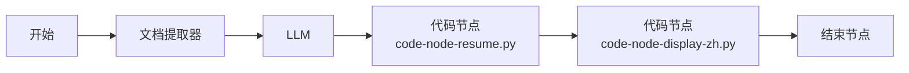

# 简历结构化结果 — 中文标签展示方案

业务侧（API、数据库、下游系统）建议继续使用英文 snake_case 的 `result` JSON；面向**最终用户**（Web App、聊天窗口、邮件摘要）时，用中文标签渲染可读内容。

字段映射表：[`examples/labels-zh.json`](../examples/labels-zh.json)

---

## 推荐工作流位置



| 节点 | 输出给用户的变量 | 用途 |
|------|------------------|------|
| 解析代码节点 | `result` | 英文 JSON，API / 入库 |
| **展示代码节点** | `display_markdown` | 中文 Markdown，聊天 / Web 展示 |
| **展示代码节点** | `display_json` | 中文键 JSON，表格组件 |
| **展示代码节点** | `result` | 透传英文 JSON，与上游一致 |

---

## 方案 1：Dify 代码节点（推荐）

在现有 [`code-node-resume.py`](code-node-resume.py) **之后**新增一个 **代码** 节点，粘贴 [`code-node-display-zh.py`](code-node-display-zh.py) 全文。

### 画布操作

1. 从节点面板拖入第二个 **代码** 节点，接在「简历解析」代码节点之后。
2. **输入变量**：仅添加 `result`，绑定 **上一代码节点** 的 `result`。
3. **输出变量**（在 Dify 界面手动声明类型）：
   - `valid` — 布尔
   - `result` — 字符串（透传英文 JSON）
   - `display_markdown` — 字符串
   - `display_json` — 字符串
   - `error` — 字符串
4. 将 [`code-node-display-zh.py`](code-node-display-zh.py) **全文复制**到代码编辑区并保存。
5. **结束节点**：
   - 给 API / 集成：`resume_json` ← 展示节点的 `result`
   - 给用户看：`display_text` ← 展示节点的 `display_markdown`
   - 可选：`display_json` ← 展示节点的 `display_json`

### 核心函数说明

| 函数 | 作用 |
|------|------|
| `to_display_markdown(data)` | 按章节输出中文 Markdown（表格 + 列表） |
| `to_display_json(data)` | 将英文键转为中文键的 dict，再 `json.dumps` |

标签内嵌于 Python 文件，与 `examples/labels-zh.json` 保持同步；修改标签时两处一起改。

### 与解析节点合并（可选）

若希望**一个代码节点**同时解析 + 展示，可在 `code-node-resume.py` 的 `main()` 成功分支末尾追加 `to_display_markdown(data)` 与 `to_display_json(data)` 的调用，并把两个函数及 `LABELS` 常量**粘贴进同一文件**。

Dify 云端**不能**跨文件 import，因此更推荐**独立展示节点**，便于单独升级标签而不动解析逻辑。

---

## 方案 2：Dify 模板 / 直接回复节点

适用于 Chatflow 或工作流末尾的 **直接回复（Answer）** / **模板** 节点，字段少、不想写 Python 时。

### 思路

在回复模板中用变量占位符逐项输出中文标签，例如（语法以当前 Dify 版本为准）：

```jinja2
## 基本信息
- 姓名：{{#代码.result.basic.name#}}
- 电话：{{#代码.result.basic.phone#}}
- 邮箱：{{#代码.result.basic.email#}}

## 教育背景

- {{ edu.school }} · {{ edu.major }}（{{ edu.degree }}）


## 技能
{{ 代码.result.skills | join('、') }}
```

### 局限

| 优点 | 缺点 |
|------|------|
| 无需第二段 Python | 需 Dify 支持 Jinja / 对象点号访问 |
| 改文案可在界面完成 | 数组循环、空值、`work_experience` 多条时模板冗长 |
| | 结构化输出为**字符串**时须先绑 object 或再解析 |

**工作流（Workflow）** 通常以 **结束节点变量** 暴露结果；Web App 若支持 Markdown 变量，将 `display_markdown` 绑到回复内容最省事。Chatflow 可在 Answer 节点引用上游 `display_markdown`。

---

## 方案 3：外部系统 / API 消费

调用方拿到工作流 API 返回的 `resume_json`（英文 JSON 字符串）后，在自有服务中用映射表渲染。

### 映射文件

[`examples/labels-zh.json`](../examples/labels-zh.json) 提供：

- `sections` — 顶层区块中文名
- `fields` — 点分路径 → 标签（如 `basic.name` → `姓名`）
- `array_item_labels` — 列表项标题前缀

### Node.js 示例（片段）

```javascript
const labels = require('./labels-zh.json');

function labelFor(path) {
  return labels.fields[path] || path.split('.').pop();
}

function renderBasic(basic) {
  return Object.entries(basic)
    .filter(([k, v]) => v != null && !k.startsWith('_'))
    .map(([k, v]) => `${labelFor('basic.' + k)}：${v}`)
    .join('\n');
}
```

### Python 示例（片段）

```python
import json

with open("examples/labels-zh.json", encoding="utf-8") as f:
    LABELS = json.load(f)

# 将 code-node-display-zh.py 中的 to_display_markdown 复制到项目后：
markdown = to_display_markdown(en_json)
```

生产环境可直接复用 [`code-node-display-zh.py`](code-node-display-zh.py) 中的 `to_display_markdown`，避免重复维护。

---

## 示例：`display_markdown` 输出（脱敏）

以下由 [`code-node-display-zh.py`](code-node-display-zh.py) 对一份**应届软件工程**简历 JSON 生成；姓名保留便于对照结构，**手机号、邮箱已脱敏**。

<details>
<summary>输入 JSON（英文键，节选）</summary>

```json
{
  "basic": {
    "name": "张某某",
    "phone": "138****0000",
    "email": "zhang.example@mail.demo",
    "city": "上海",
    "years_of_experience": 0
  },
  "education": [
    {
      "school": "示例理工大学",
      "major": "软件工程",
      "degree": "本科",
      "start_date": "2020-09",
      "end_date": "2024-06"
    }
  ],
  "work_experience": [
    {
      "company": "示例科技有限公司",
      "title": null,
      "start_date": "2023-09",
      "end_date": "2024-02",
      "description": "负责数据库日常管理与维护，编写并优化 SQL 语句……"
    },
    {
      "company": "演示数仓项目",
      "title": "项目经验",
      "start_date": null,
      "end_date": null,
      "description": "参与演示数仓项目，负责数据采集与数据处理流程……"
    }
  ],
  "skills": ["Java", "Python", "Hadoop", "Spark", "Hive", "Kafka", "Docker", "PyTorch"],
  "summary": "软件工程本科，具备数据库管理、SQL 优化、数据仓库项目和生成式 AI 项目实践经验……"
}
```

</details>

**生成的 `display_markdown`：**

```markdown
## 基本信息
| 字段 | 内容 |
| --- | --- |
| 姓名 | 张某某 |
| 联系电话 | 138****0000 |
| 电子邮箱 | zhang.example@mail.demo |
| 所在城市 | 上海 |
| 工作年限（年） | 0 |

## 教育背景
### 教育经历 1
- **学校**：示例理工大学
- **专业**：软件工程
- **学历**：本科
- **时间**：2020-09 ~ 2024-06

## 工作/项目经历
### 经历 1
- **公司/项目**：示例科技有限公司
- **时间**：2023-09 ~ 2024-02
- **职责描述**：负责数据库日常管理与维护，编写并优化 SQL 语句……

### 经历 2
- **公司/项目**：演示数仓项目
- **职位**：项目经验
- **职责描述**：参与演示数仓项目，负责数据采集与数据处理流程……

## 技能特长
Java、Python、Hadoop、Spark、Hive、Kafka、Docker、PyTorch

## 职业摘要
软件工程本科，具备数据库管理、SQL 优化、数据仓库项目和生成式 AI 项目实践经验……
```

---

## 结束节点变量建议

| 暴露变量名 | 绑定来源 | 面向 |
|------------|----------|------|
| `valid` | 解析代码节点 `valid` | 调用方判断成功与否 |
| `error` | 解析或展示节点 `error` | 错误信息 |
| `resume_json` | 展示节点 `result` | 英文 JSON 字符串，业务入库 |
| `display_markdown` | 展示节点 `display_markdown` | 最终用户 Markdown |
| `display_json` | 展示节点 `display_json` | 中文键 JSON（可选） |

Web App 聊天窗口：将 **直接回复** 或 **结束** 的默认输出设为 `display_markdown`。  
HTTP API：在 `outputs` 中同时返回 `resume_json` 与 `display_markdown`，由前端决定展示方式。

---

## 相关文件

| 文件 | 说明 |
|------|------|
| [`code-node-display-zh.py`](code-node-display-zh.py) | Dify 展示代码节点（复制粘贴） |
| [`code-node-resume.py`](code-node-resume.py) | 解析与规范化（上游） |
| [`examples/labels-zh.json`](../examples/labels-zh.json) | 字段 → 中文标签映射 |
| [`dify-workflow.md`](dify-workflow.md) | 完整搭建步骤（含展示节点连线） |
