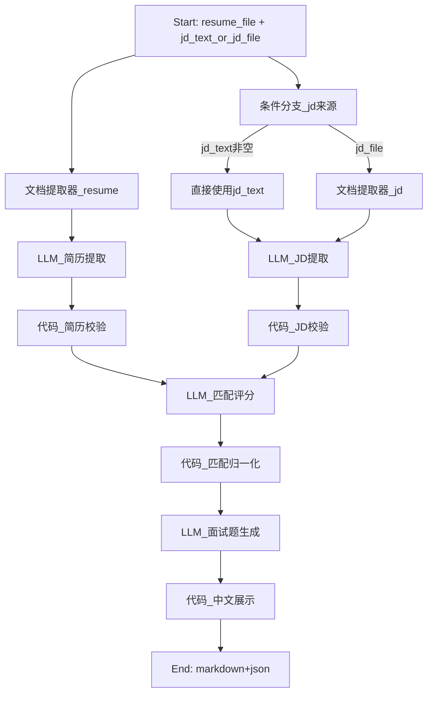

# AI 招聘初筛工作流（二期）

本文档给出在现有「简历提取器」基础上升级为「招聘初筛与面试助手」的完整工作流设计。二期目标是把候选人简历与岗位 JD 同时结构化，输出匹配评分、风险点与面试题，并提供面向业务方的中文展示结果。

## 一、输入与输出

### 输入（Start）

- `resume_file`：候选人简历文件（pdf/docx/txt）
- `jd_text`（可选）：岗位描述文本（纯文本）
- `jd_file`（可选）：岗位描述文件（pdf/docx/txt）

> 推荐优先使用 `jd_text`，便于调试；若业务来自上传文件，再启用 `jd_file` + 文档提取器。

### 输出（End）

- `resume_json`：简历结构化 JSON（英文键）
- `jd_json`：JD 结构化 JSON（英文键）
- `match_json`：匹配评分 JSON
- `interview_questions_json`：面试题 JSON
- `display_markdown`：中文展示文本（给招聘方或面试官直接查看）
- `valid`：流程是否有效
- `error`：错误信息（可选）

## 二、节点链路

## 三、与一期工作流的关系

- 一期已完成：简历提取、JSON 校验、中文展示。
- 二期复用：
  - `docs/prompt-system.txt`
  - `docs/prompt-user-template.txt`
  - `docs/code-node-resume.py`
  - `docs/code-node-display-zh.py`
- 二期新增：
  - JD 提取提示词与代码节点
  - 匹配评分提示词与归一化代码节点
  - 面试题提示词
  - 二期 Schema 与样例

## 四、关键配置约束

### 1) 继续遵循方案 A

- SYSTEM 只放规则与 Schema。
- USER 必须包含原文变量引用。
- LLM 上下文（Context）建议留空，避免「挂了变量但未引用」导致空结果。

### 2) 各 LLM 节点变量输入建议

- `LLM_简历提取`：`{{#文档提取器_resume.text#}}`
- `LLM_JD提取`：`{{#开始.jd_text#}}` 或 `{{#文档提取器_jd.text#}}`
- `LLM_匹配评分`：使用 `resume_json` + `jd_json`
- `LLM_面试题生成`：使用 `match_json` + `resume_json` + `jd_json`

### 3) 结束节点建议同时输出机器可读与人类可读

- API/入库：`resume_json`、`jd_json`、`match_json`、`interview_questions_json`
- 前台展示：`display_markdown`

## 五、分支与失败处理建议

- 若 `codeResume.valid = false`：直接返回 `error`，终止后续节点。
- 若 `codeJd.valid = false`：直接返回 `error`，终止后续节点。
- 若 `codeMatch.match_score < 50`：走「不建议进入面试」的展示模板。
- 若 `llmInterview` 输出为空：保留 `match_json`，并在 `error` 标注「面试题生成失败」。

## 六、最小可运行版本（先跑通）

先做最小链路：

1. `resume_file` + `jd_text`
2. 简历提取 + JD 提取
3. 匹配评分
4. 中文展示

确认可运行后再加：

- `jd_file` 文件输入路径
- 面试题生成
- 更精细的低分/高分分支模板

## 七、关联文件

- 7 天落地计划：`docs/recruitment-screening-7day-plan.md`
- JD 提取提示词：`docs/prompt-jd-extraction.txt`、`docs/prompt-jd-user-template.txt`
- 匹配评分提示词：`docs/prompt-match-score.txt`、`docs/prompt-match-user-template.txt`
- 面试题提示词：`docs/prompt-interview-questions.txt`、`docs/prompt-interview-user-template.txt`
- JD/匹配/面试题 Schema：`examples/schema-jd.json`、`examples/schema-match-result.json`、`examples/schema-interview-questions.json`
